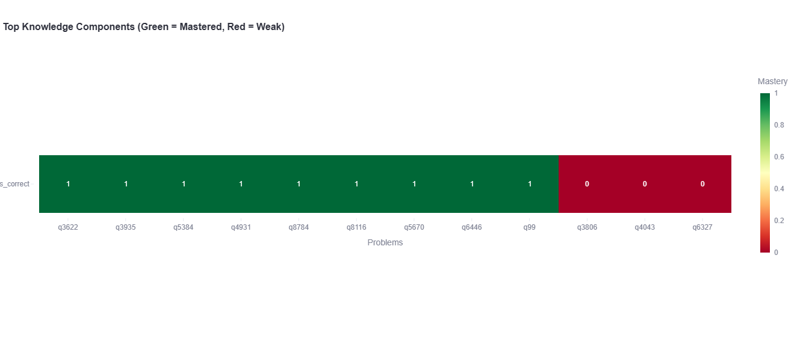
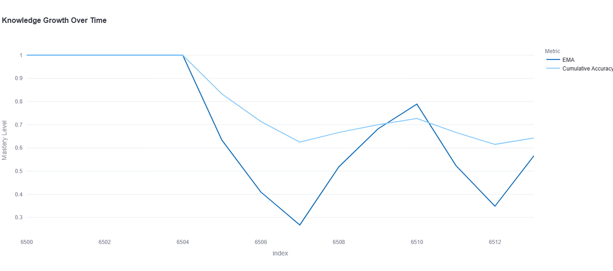

# EduAI – Intelligent Coding Course Recommender

## Overview

EduAI is a research-grade, interpretable recommendation system designed to personalize coding education for learners. The system leverages **GRU-based Knowledge Tracing** to model student learning dynamics, detect performance instability, and generate **personalized next-problem recommendations**.

The platform provides both predictive analytics and **transparent interpretability**, enabling educators and researchers to understand learner progress while tailoring interventions for maximum effectiveness.

---

## Research Objectives

1. **Model Student Knowledge Evolution**  
   Capture the latent knowledge state of learners over time using sequential interaction data.

2. **Detect Learning Instability and Risk Patterns**  
   Identify sudden drops in learning performance to flag at-risk learners.

3. **Personalized Problem Recommendation**  
   Recommend Top-N coding problems tailored to each student’s mastery profile.

4. **Explainable Learning Analytics**  
   Combine learning curves and knowledge heatmaps to provide interpretable insights.

---

## System Features

### 1. GRU-Based Knowledge Tracing
- Sequential modeling of learner interactions
- Embedding of problem attempts and correctness
- Dynamic latent knowledge state tracking

### 2. Top-N Personalized Recommendations
- Probability-based ranking of candidate problems
- Normalized Top-N scores for interpretability
- Focus on weak and high-impact learning areas

### 3. Learning Curve Analytics
- **Exponential Moving Average (EMA)**: short-term performance stability
- **Cumulative Accuracy**: overall learning trajectory
- Sharp-drop detection to identify conceptual gaps

### 4. Knowledge Heatmap
- Visual representation of mastery across problems
- Color-coded: green (high mastery), yellow (medium), red (weak)
- Insight into strengths, weaknesses, and intervention points

### 5. Personalized Learning Plan
- Combines weak mastery items and sudden learning drops
- High-priority problems for immediate focus
- Medium-priority problems for reinforcement

---

## Installation and Requirements

### Python Dependencies
- `streamlit`
- `pandas`
- `numpy`
- `torch`
- `plotly`

> Install via:
```bash
pip install -r requirements.txt
```

## Hardware Recommendations

- **Minimum:** CPU, 8 GB RAM  
- **Recommended:** NVIDIA CUDA-enabled GPU, ≥ 16 GB RAM for research-scale experiments

## Dataset

- Sequential learner-problem interaction data with columns: `student_id`, `problem_id`, `timestamp`, `correctness (0/1)`  
- **Dataset not included** due to privacy and licensing restrictions  
- Synthetic or licensed datasets are recommended for reproduction

## Results Visualization

Example outputs from the system:

  
*Figure 1: Knowledge State Heatmap showing mastery levels across problems.*

  
*Figure 2: Student Learning Curve with EMA and cumulative accuracy.*

## Research Implications

- Provides interpretable insights for educational data mining  
- Bridges predictive modeling with actionable interventions  
- Supports reproducible, research-grade experiments in personalized education  
- Designed to meet academic rigor for top-tier universities

## Ethical Considerations

- Compliant with educational data mining ethics  
- Transparent and reproducible methods  
- No high-stakes automated decision-making; intended for research and teaching purposes

## Summary

EduAI demonstrates a **scalable, interpretable, and actionable** approach to personalized coding education. By combining **knowledge tracing, predictive modeling, and explainable visual analytics**, it offers both researchers and educators a powerful tool to enhance student learning outcomes.

This project targets **research evaluation and adoption in world-leading universities** by providing a **reproducible, transparent, and high-impact methodology** for personalized educational interventions.
